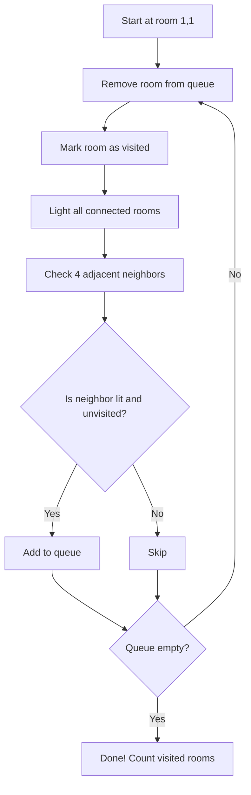

# Introduction

Bessie the cow finds herself in a peculiar situation. She's standing in a large barn organized as an $N \times N$ grid of rooms, and she needs to visit as many rooms as possible. The challenge? Most rooms are completely dark, and Bessie can only walk into rooms that are lit.

The barn has a special lighting system with $M$ connections. Each connection is defined by two room positions: $(a, b)$ and $(x, y)$. When Bessie stands in room $(a, b)$, she can flip a switch that lights up room $(x, y)$. Initially, only the room at position $(1, 1)$ where Bessie starts is lit.

Bessie can only move to adjacent rooms (up, down, left, or right) that are already lit. The question is: how many rooms can Bessie visit by strategically using the light switches and moving through the barn?

## Input Format

The input consists of:
- **Line 1**: Two integers $N$ and $M$
  - $N$: The dimension of the grid (the barn is $N \times N$)
  - $M$: The number of light switch connections
- **Lines 2 to M+1**: Four integers $a, b, x, y$ (all 1-indexed)
  - Being in room $(a, b)$ allows you to light up room $(x, y)$

## Example

Consider a $3 \times 3$ grid with the following connections:

```
N = 3, M = 3
1 1 1 3
2 1 3 1
2 3 3 3
```

This means:
- From room $(1,1)$, we can light room $(1,3)$
- From room $(2,1)$, we can light room $(3,1)$
- From room $(2,3)$, we can light room $(3,3)$

# Algorithm

The solution uses a modified Breadth-First Search (BFS) algorithm with two key events at each step:

## Key Insights

1. **Event 1 - Lighting**: When we visit a room $(a, b)$, we immediately activate all light switches available from that position, lighting up all connected rooms $(x, y)$.

2. **Event 2 - Movement**: We can only move to adjacent rooms (4-directional: up, down, left, right) that are already lit.

3. **Queue Management**: We use a queue to track which rooms we can visit next. A room is added to the queue only if:
   - It is lit (either initially or by a switch)
   - It is adjacent to a room we've already visited
   - We haven't visited it yet


## Explanation


## Pseudocode

```python
def count_reachable_rooms(N, connections):
    # Initialize
    lit = {(1,1)}  # Room (1,1) starts lit
    visited = set()
    queue = [(1,1)]
    
    while queue:
        # Dequeue current room
        (a, b) = queue.pop(0)
        
        # Skip if already visited
        if (a, b) in visited:
            continue
            
        # Mark as visited
        visited.add((a, b))
        
        # Event 1: Light all rooms accessible from (a,b)
        for (x, y) in connections[(a,b)]:
            lit.add((x, y))
        
        # Event 2: Check 4 neighbors
        for (na, nb) in [(a-1,b), (a+1,b), (a,b-1), (a,b+1)]:
            # If neighbor is in bounds, lit, and unvisited
            if 1 <= na <= N and 1 <= nb <= N:
                if (na, nb) in lit and (na, nb) not in visited:
                    if (na, nb) not in queue:
                        queue.append((na, nb))
    
    return len(visited)
```

## Complexity Analysis

- **Time Complexity**: $O(N^2 + M)$
  - We visit each room at most once: $O(N^2)$
  - We process each connection at most once: $O(M)$

- **Space Complexity**: $O(N^2 + M)$
  - Storage for lit rooms, visited rooms, and queue: $O(N^2)$
  - Storage for connections: $O(M)$

## Walkthrough Example

Let's trace through our $3 \times 3$ example step by step:

**Initial State:**
- Lit: $(1,1)$
- Visited: $\{\}$
- Queue: $[(1,1)]$

**Step 1:** Visit $(1,1)$
- Light room $(1,3)$ (from connection)
- Check neighbors: $(1,2)$ is not lit, $(2,1)$ is not lit
- Lit: $(1,1), (1,3)$
- Visited: $(1,1)$
- Queue: $[]$

At this point, no adjacent rooms are lit, so we're stuck!

**Better Example:** Let's modify with connection $(1,1) \to (1,2)$:

**Step 1:** Visit $(1,1)$
- Light room $(1,2)$
- Add $(1,2)$ to queue (it's adjacent and lit)
- Visited: $(1,1)$
- Queue: $[(1,2)]$

**Step 2:** Visit $(1,2)$
- Light any connected rooms
- Check $(1,3)$, $(1,1)$ (visited), $(2,2)$
- Visited: $(1,1), (1,2)$
- Queue: continues...

The algorithm continues until no more reachable rooms remain in the queue.

# Interactive Visualization

Below is an interactive simulator where you can see the algorithm in action. Try different grid sizes and connection patterns to understand how Bessie explores the barn!

<div id="simulator-container"></div>

<script>
function createSimulator() {
    const container = document.getElementById('simulator-container');
    if (!container) return;
    
    container.innerHTML = `
        <style>
            .sim-container {
                font-family: Arial, sans-serif;
                background: white;
                padding: 20px;
                border-radius: 8px;
                box-shadow: 0 2px 8px rgba(0,0,0,0.1);
                margin: 20px 0;
            }
            .sim-input-section {
                margin-bottom: 20px;
                padding: 15px;
                background: #f9f9f9;
                border-radius: 5px;
            }
            .sim-input-group {
                margin-bottom: 10px;
            }
            .sim-label {
                display: inline-block;
                width: 150px;
                font-weight: bold;
            }
            .sim-input {
                padding: 5px 10px;
                border: 1px solid #ddd;
                border-radius: 3px;
                width: 200px;
            }
            .sim-button {
                padding: 10px 20px;
                margin: 5px;
                background: #4CAF50;
                color: white;
                border: none;
                border-radius: 5px;
                cursor: pointer;
                font-size: 14px;
            }
            .sim-button:hover {
                background: #45a049;
            }
            .sim-button:disabled {
                background: #ccc;
                cursor: not-allowed;
            }
            .sim-step-button {
                background: #2196F3;
            }
            .sim-step-button:hover {
                background: #0b7dda;
            }
            .sim-reset-button {
                background: #f44336;
            }
            .sim-reset-button:hover {
                background: #da190b;
            }
            .sim-grid {
                display: inline-grid;
                gap: 2px;
                margin: 20px 0;
                padding: 10px;
                background: #e0e0e0;
                border-radius: 5px;
            }
            .sim-cell {
                width: 50px;
                height: 50px;
                border: 2px solid #333;
                display: flex;
                align-items: center;
                justify-content: center;
                font-size: 12px;
                font-weight: bold;
                transition: all 0.3s;
                position: relative;
            }
            .sim-cell.dark {
                background: #2c2c2c;
                color: #666;
            }
            .sim-cell.lit {
                background: #fff9c4;
                color: #333;
            }
            .sim-cell.visited {
                background: #81c784;
                color: white;
            }
            .sim-cell.current {
                background: #2196F3;
                color: white;
                box-shadow: 0 0 10px #2196F3;
            }
            .sim-connections-input {
                width: 100%;
                min-height: 80px;
                padding: 10px;
                font-family: monospace;
            }
            .sim-info {
                margin: 15px 0;
                padding: 10px;
                background: #e3f2fd;
                border-left: 4px solid #2196F3;
                border-radius: 3px;
            }
            .sim-legend {
                display: flex;
                gap: 20px;
                flex-wrap: wrap;
                margin: 15px 0;
            }
            .sim-legend-item {
                display: flex;
                align-items: center;
                gap: 8px;
            }
            .sim-legend-box {
                width: 30px;
                height: 30px;
                border: 2px solid #333;
            }
            .sim-stats {
                display: flex;
                gap: 30px;
                margin: 15px 0;
                font-size: 16px;
            }
        </style>
        
        <div class="sim-container">
            <div class="sim-input-section">
                <div class="sim-input-group">
                    <label class="sim-label">Grid Size (N):</label>
                    <input type="number" id="simGridSize" class="sim-input" value="5" min="2" max="10">
                </div>
                <div class="sim-input-group">
                    <label class="sim-label">Connections:</label>
                    <textarea id="simConnections" class="sim-connections-input" placeholder="Enter connections as: a,b,x,y (one per line, 1-indexed)
Example:
1,1,3,3
1,1,5,5
2,2,4,4"></textarea>
                </div>
                <button onclick="simInitialize()" class="sim-button">Initialize Grid</button>
                <button onclick="simAutoStep()" id="simAutoBtn" class="sim-button">Auto Run</button>
                <button onclick="simStep()" id="simStepBtn" class="sim-button sim-step-button" disabled>Step</button>
                <button onclick="simReset()" class="sim-button sim-reset-button">Reset</button>
            </div>

            <div class="sim-legend">
                <div class="sim-legend-item">
                    <div class="sim-legend-box dark"></div>
                    <span>Dark Room</span>
                </div>
                <div class="sim-legend-item">
                    <div class="sim-legend-box lit"></div>
                    <span>Lit Room</span>
                </div>
                <div class="sim-legend-item">
                    <div class="sim-legend-box visited"></div>
                    <span>Visited Room</span>
                </div>
                <div class="sim-legend-item">
                    <div class="sim-legend-box current"></div>
                    <span>Current Position</span>
                </div>
            </div>

            <div class="sim-stats">
                <div><strong>Current Position:</strong> <span id="simCurrentPos">(1, 1)</span></div>
                <div><strong>Rooms Visited:</strong> <span id="simVisitedCount">0</span></div>
                <div><strong>Rooms Lit:</strong> <span id="simLitCount">0</span></div>
            </div>

            <div class="sim-info" id="simInfo">Click "Initialize Grid" to start</div>

            <div class="sim-grid" id="simGrid"></div>
        </div>
    `;

    // Set default connections
    document.getElementById('simConnections').value = '1,1,1,2\n1,2,2,2\n2,2,2,3\n2,3,3,3';

    // Initialize simulator state
    window.simState = {
        N: 5,
        connections: {},
        lit: {},
        visited: {},
        queue: [],
        currentPos: null,
        autoInterval: null
    };
}

function simInitialize() {
    const state = window.simState;
    state.N = parseInt(document.getElementById('simGridSize').value);
    
    if (state.N < 2 || state.N > 10) {
        alert('Grid size must be between 2 and 10');
        return;
    }

    // Parse connections (convert from 1-indexed to 0-indexed)
    state.connections = {};
    const connText = document.getElementById('simConnections').value.trim();
    if (connText) {
        const lines = connText.split('\n');
        for (let line of lines) {
            const parts = line.trim().split(',').map(x => parseInt(x.trim()));
            if (parts.length === 4) {
                const [a, b, x, y] = parts;
                const key = `${a-1},${b-1}`;
                if (!state.connections[key]) state.connections[key] = [];
                state.connections[key].push([x-1, y-1]);
            }
        }
    }

    // Reset state
    state.lit = {};
    state.visited = {};
    state.queue = [[0, 0]];
    state.currentPos = null;
    state.lit['0,0'] = true;

    simRenderGrid();
    document.getElementById('simStepBtn').disabled = false;
    document.getElementById('simInfo').textContent = 'Algorithm ready. Starting at room (1,1). Click "Step" to proceed or "Auto Run" for automatic execution.';
    simUpdateStats();
}

function simRenderGrid() {
    const state = window.simState;
    const grid = document.getElementById('simGrid');
    grid.innerHTML = '';
    grid.style.gridTemplateColumns = `repeat(${state.N}, 50px)`;

    for (let i = 0; i < state.N; i++) {
        for (let j = 0; j < state.N; j++) {
            const cell = document.createElement('div');
            cell.className = 'sim-cell';
            cell.textContent = `${i+1},${j+1}`;
            
            const key = `${i},${j}`;
            
            if (state.currentPos && state.currentPos[0] === i && state.currentPos[1] === j) {
                cell.classList.add('current');
            } else if (state.visited[key]) {
                cell.classList.add('visited');
            } else if (state.lit[key]) {
                cell.classList.add('lit');
            } else {
                cell.classList.add('dark');
            }
            
            grid.appendChild(cell);
        }
    }
}

function simStep() {
    const state = window.simState;
    
    if (state.queue.length === 0) {
        document.getElementById('simInfo').textContent = 'Algorithm completed! No more rooms to visit.';
        document.getElementById('simStepBtn').disabled = true;
        if (state.autoInterval) {
            clearInterval(state.autoInterval);
            state.autoInterval = null;
            document.getElementById('simAutoBtn').textContent = 'Auto Run';
        }
        return false;
    }

    // Dequeue a room
    state.currentPos = state.queue.shift();
    const [a, b] = state.currentPos;
    const key = `${a},${b}`;

    // Mark as visited
    state.visited[key] = true;

    // Event 1: Light all rooms accessible from this position
    if (state.connections[key]) {
        for (let [x, y] of state.connections[key]) {
            const targetKey = `${x},${y}`;
            if (!state.lit[targetKey]) {
                state.lit[targetKey] = true;
            }
        }
    }

    // Event 2: Check 4-neighbors - if they are lit, add them to queue
    const neighbors = [
        [a-1, b], [a+1, b], [a, b-1], [a, b+1]
    ];

    for (let [nx, ny] of neighbors) {
        if (nx >= 0 && nx < state.N && ny >= 0 && ny < state.N) {
            const nKey = `${nx},${ny}`;
            if (state.lit[nKey] && !state.visited[nKey]) {
                if (!state.queue.some(([qx, qy]) => qx === nx && qy === ny)) {
                    state.queue.push([nx, ny]);
                }
            }
        }
    }

    simRenderGrid();
    simUpdateStats();
    document.getElementById('simInfo').textContent = `Visited room (${a+1}, ${b+1}). Queue length: ${state.queue.length}`;
    
    return state.queue.length > 0;
}

function simAutoStep() {
    const state = window.simState;
    
    if (state.autoInterval) {
        clearInterval(state.autoInterval);
        state.autoInterval = null;
        document.getElementById('simAutoBtn').textContent = 'Auto Run';
    } else {
        document.getElementById('simAutoBtn').textContent = 'Pause';
        state.autoInterval = setInterval(() => {
            if (!simStep()) {
                clearInterval(state.autoInterval);
                state.autoInterval = null;
                document.getElementById('simAutoBtn').textContent = 'Auto Run';
            }
        }, 500);
    }
}

function simReset() {
    const state = window.simState;
    
    if (state.autoInterval) {
        clearInterval(state.autoInterval);
        state.autoInterval = null;
        document.getElementById('simAutoBtn').textContent = 'Auto Run';
    }
    simInitialize();
}

function simUpdateStats() {
    const state = window.simState;
    document.getElementById('simCurrentPos').textContent = state.currentPos ? `(${state.currentPos[0]+1}, ${state.currentPos[1]+1})` : '(1, 1)';
    document.getElementById('simVisitedCount').textContent = Object.keys(state.visited).length;
    document.getElementById('simLitCount').textContent = Object.keys(state.lit).length;
}

// Initialize when the page loads
if (document.readyState === 'loading') {
    document.addEventListener('DOMContentLoaded', createSimulator);
} else {
    createSimulator();
}
</script>

# Key Takeaways

1. **BFS with Constraints**: This problem demonstrates how BFS can be modified to handle additional constraints (lighting requirements) beyond simple connectivity.

2. **Two-Phase Processing**: The algorithm elegantly separates lighting (Event 1) from movement (Event 2), making the logic clear and correct.

3. **State Management**: We track three distinct states: rooms that are lit, rooms that are visited, and rooms in our queue. Each serves a specific purpose.

4. **Graph Construction**: The connections define an implicit directed graph where edges represent light switches rather than physical paths.

5. **Greedy Exploration**: By using BFS and always lighting available rooms, we ensure we explore all reachable areas of the barn.

# Practice Problems

To further practice this concept, try these related problems:

- **USACO Silver - Switching on the Lights**: The original inspiration for this problem
- **Codeforces - Graph Traversal with Constraints**: Similar problems involving conditional edge activation
- **LeetCode - Keys and Rooms**: A simpler version focusing on unlocking rooms

# Conclusion

The "Bessie and the Lights" problem beautifully combines graph traversal with state management and constraint satisfaction. By understanding how to separate the lighting mechanism from the movement mechanism, we can solve this efficiently using a modified BFS approach. The key insight is recognizing that we need to track both what's reachable (lit) and what we've explored (visited) as two separate concepts.

Happy coding, and may your barns always be well-lit! 🐄💡
