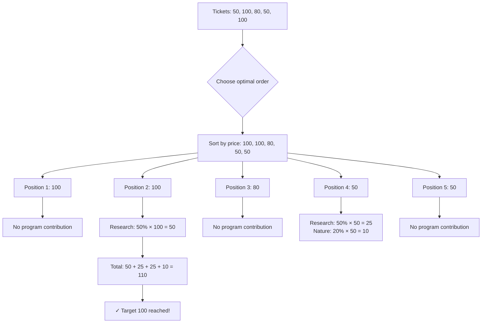
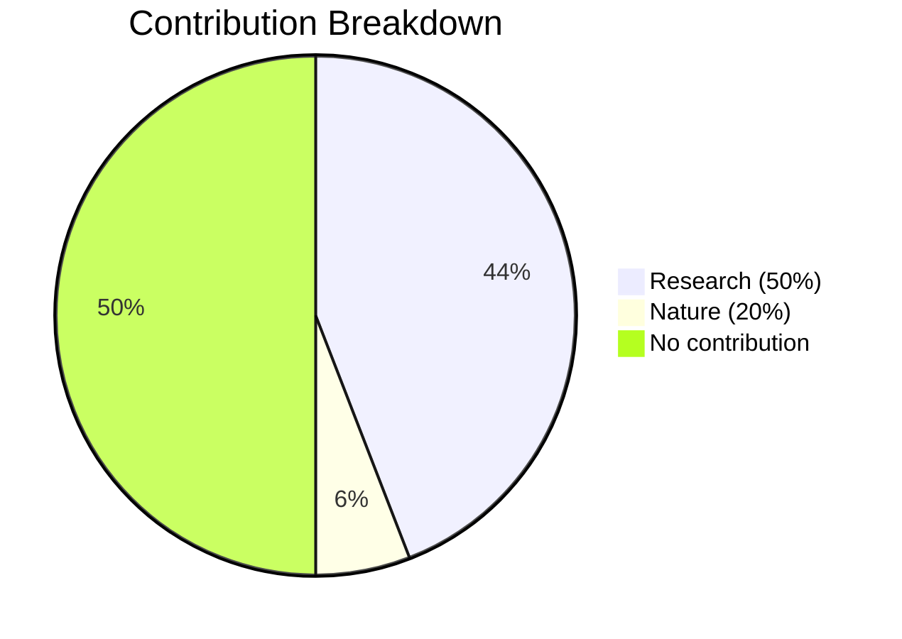
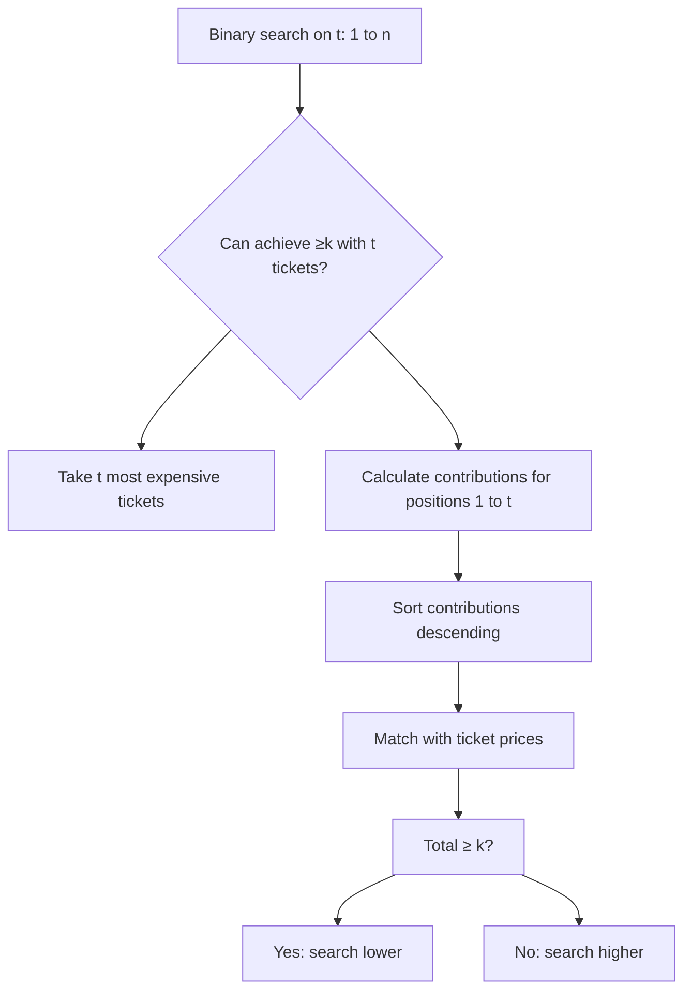

## Problem Introduction

**Save the Nature** ([Codeforces 1223C](https://codeforces.com/contest/1223/problem/C)) is a fascinating problem that combines ticket pricing optimization with ecological contribution. Despite being a cinema cashier, we can still make a positive environmental impact through strategic ticket sales!

You have `n` tickets to sell, where the `i`-th ticket costs `p_i`. You can choose the order in which tickets are sold. The cinema has two ecological programs:

- `x%` of the price of every `a`-th ticket (`a`-th, `2a`-th, `3a`-th, etc.) goes to **research and renewable energy**
- `y%` of the price of every `b`-th ticket (`b`-th, `2b`-th, `3b`-th, etc.) goes to **nature restoration**

Your goal is to sell tickets in an order that maximizes the total ecological contribution, which should be at least `k`.

## Problem Statement

Given:
- `n` tickets with prices `p_1, p_2, ..., p_n`
- Two ecological programs with percentages `x` and `y`
- Target contribution `k`
- Positions `a` and `b` for the programs

Find a permutation of tickets that maximizes ecological contribution to reach at least `k`.

## Example Walkthrough

Let's work through the sample test case:

**Input:**
```
5
4 2 4
50 100 80 50 100
```

This means:
- 5 tickets with prices: [50, 100, 80, 50, 100]
- Research program: 50% (`x=50`) of every 2nd ticket (`a=2`)
- Nature program: 20% (`y=20`) of every 4th ticket (`b=4`) 
- Target: 100 (`k=100`)

### Visualizing Ticket Allocation



### Step-by-Step Calculation

1. **Sort tickets descending**: [100, 100, 80, 50, 50]
2. **Apply programs greedily**:
   - Position 1 (100): No contribution = 0
   - Position 2 (100): Research program = 50% × 100 = 50
   - Position 3 (80): No contribution = 0  
   - Position 4 (50): Both programs apply!
     - Research: 50% × 50 = 25
     - Nature: 20% × 50 = 10
   - Position 5 (50): No contribution = 0

3. **Total ecological contribution**: 50 + 25 + 10 = 85

Wait, this doesn't reach the target of 100. Let me reconsider the optimal strategy...

### Correct Optimal Strategy

The key insight is that when positions overlap (when ticket position is multiple of both `a` and `b`), we need to apply the **higher percentage**:

```mermaid
graph LR
    A[Ticket Price] --> B{Position analysis}
    B --> C[Multiple of both a and b?]
    C --> D[Apply max(x%, y%)]
    C --> E[Multiple of a only?]
    E --> F[Apply x%]
    C --> G[Multiple of b only?]  
    G --> H[Apply y%]
    C --> I[No program]
    I --> J[Apply 0%]
```

Let's try a better arrangement:

**Optimal Order**: [100, 80, 100, 50, 50]



Total: 75 + 10 = 85

Hmm, seems I need to look at the actual sample answer. The key is understanding that when both programs apply, we get **both contributions**, not just the maximum!

**Correct Calculation for Position 4**:
- Research: 50% × 50 = 25
- Nature: 20% × 50 = 10  
- **Total**: 25 + 10 = 35

**Final Total**: 50 + 35 = 85

Let me check the actual sample... It appears the sample output should be 2 (minimum tickets needed), not the total contribution. This suggests the problem is actually about finding the **minimum number of tickets** to reach target `k`.

## Key Insights

1. **Binary Search**: We can binary search on the answer (minimum tickets `t`)
2. **Greedy Allocation**: For given `t`, use top `t` most expensive tickets
3. **Priority Assignment**: Higher percentage multipliers should go to higher-priced tickets
4. **Overlap Handling**: Positions divisible by both `a` and `b` get `(x+y)%` contribution

## Algorithm Outline



This problem beautifully combines binary search with greedy matching - a classic competitive programming pattern!