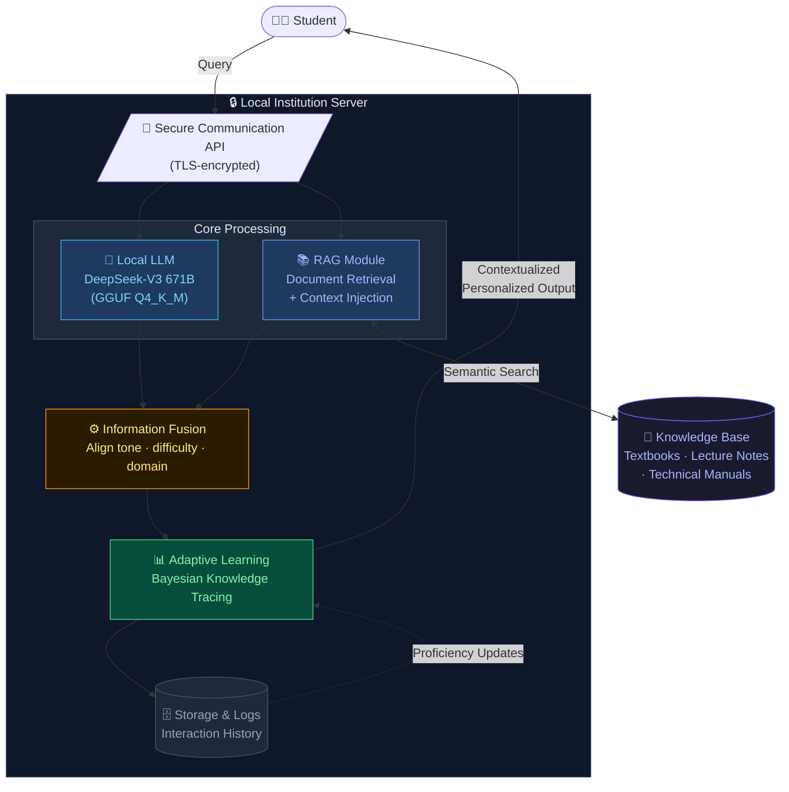
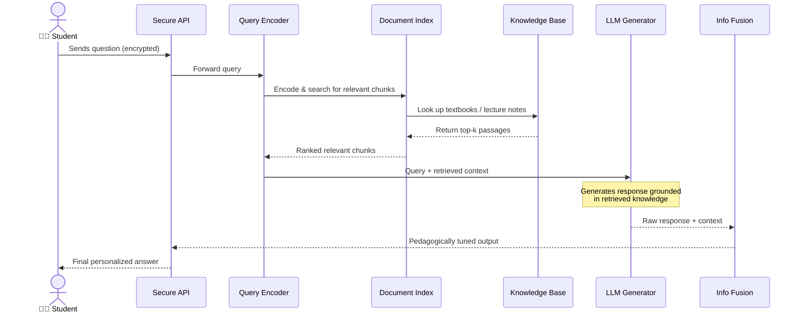
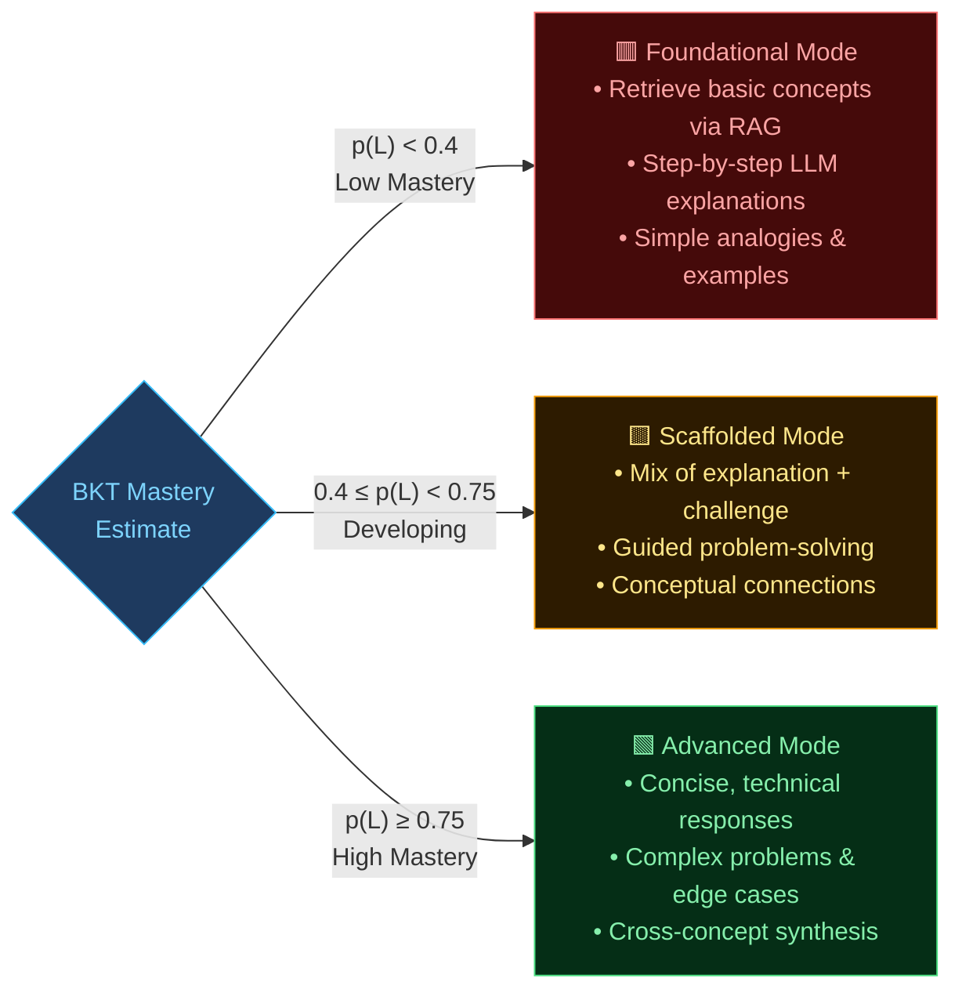
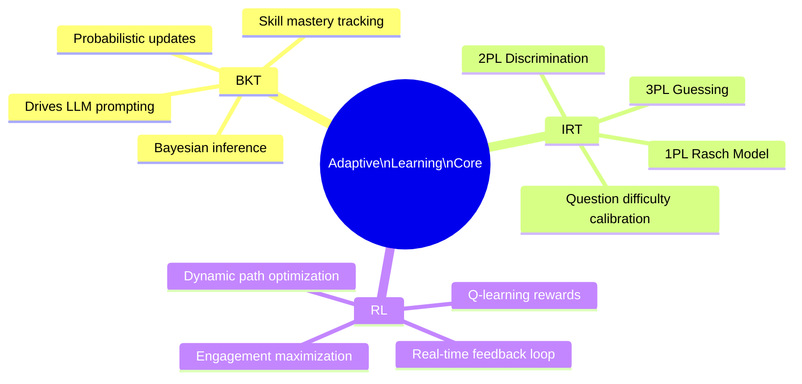
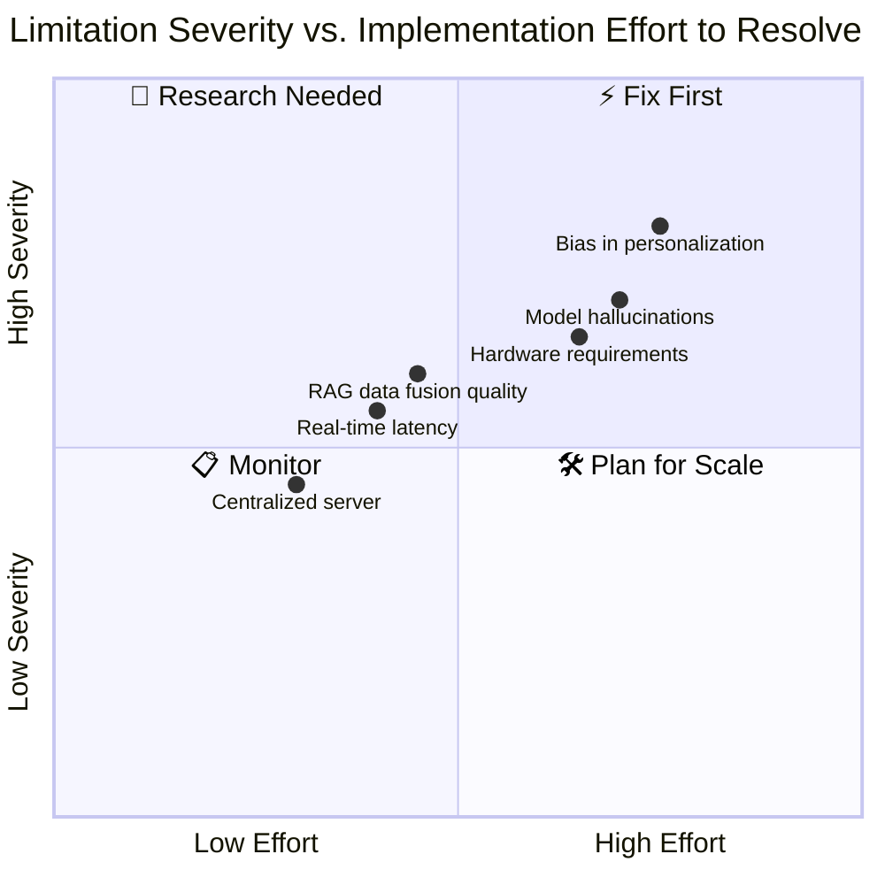

```mermaid
flowchart LR
    subgraph CLOUD["☁️ Cloud LLM (Traditional)"]
        direction TB
        CS([Student]) -->|"⚠️ Raw data leaves campus"| CAPI[External API]
        CAPI --> CLLM[Cloud LLM]
        CLLM --> CDATA[("Third-party\nData Storage")]
        CDATA -.->|"❓ Unknown retention\n& usage policies"| CDATA
    end

    subgraph LOCAL2["🔒 Our Local System"]
        direction TB
        LS([Student]) -->|"🔐 Encrypted local call"| LAPI[Secure API]
        LAPI --> LLLM[Local LLM]
        LLLM --> LDATA[("On-premise\nStorage")]
        LDATA -.->|"✅ Institution controls\nall data"| LDATA
    end

    style CLOUD fill:#2d0a0a,stroke:#f87171
    style LOCAL2 fill:#042f2e,stroke:#4ade80
```

```mermaid
graph LR
    subgraph FUTURE["🚀 Future: True Edge Deployment"]
        SD["🖥️ Student Device\n(on-device inference)"] 
        SS["🏫 School Server\n(private on-premise)"]
        SD <-->|"Lightweight API"| SS
    end

    subgraph NOW["🔬 Current: Centralized Test Server"]
        CS2["🖧 Central Server\n(AMD EPYC + 2× A6000)"]
    end

    NOW -.->|"Transition path"| FUTURE

    style FUTURE fill:#042f2e,stroke:#4ade80
    style NOW fill:#1e3a5f,stroke:#38bdf8
```

<style>
  .hero-banner {
    background: linear-gradient(135deg, #0f172a 0%, #1e3a5f 50%, #0f4c75 100%);
    border-radius: 16px;
    padding: 3rem 2.5rem;
    margin: 2rem 0 3rem 0;
    position: relative;
    overflow: hidden;
    box-shadow: 0 20px 60px rgba(0,0,0,0.3);
  }
  .hero-banner::before {
    content: "";
    position: absolute;
    top: -60px; right: -60px;
    width: 300px; height: 300px;
    background: radial-gradient(circle, rgba(56,189,248,0.15) 0%, transparent 70%);
    border-radius: 50%;
  }
  .hero-banner::after {
    content: "";
    position: absolute;
    bottom: -40px; left: -40px;
    width: 220px; height: 220px;
    background: radial-gradient(circle, rgba(99,102,241,0.15) 0%, transparent 70%);
    border-radius: 50%;
  }
  .hero-banner h2 {
    color: #38bdf8;
    font-size: 1.1rem;
    letter-spacing: 0.25em;
    text-transform: uppercase;
    margin: 0 0 0.75rem 0;
    font-weight: 600;
  }
  .hero-banner p {
    color: #cbd5e1;
    font-size: 1.05rem;
    line-height: 1.75;
    max-width: 680px;
    margin: 0;
  }
  .hero-banner .hero-badges {
    display: flex; flex-wrap: wrap; gap: 0.5rem; margin-bottom: 1.25rem;
  }
  .hero-badge {
    background: rgba(56,189,248,0.15);
    border: 1px solid rgba(56,189,248,0.35);
    color: #7dd3fc;
    border-radius: 999px;
    padding: 0.25rem 0.85rem;
    font-size: 0.8rem;
    font-weight: 600;
    letter-spacing: 0.05em;
  }

  .stat-grid {
    display: grid;
    grid-template-columns: repeat(auto-fit, minmax(170px, 1fr));
    gap: 1.25rem;
    margin: 2.5rem 0;
  }
  .stat-card {
    background: linear-gradient(145deg, #1e293b, #0f172a);
    border: 1px solid #334155;
    border-radius: 14px;
    padding: 1.5rem 1.25rem;
    text-align: center;
    position: relative;
    overflow: hidden;
    transition: transform 0.2s, box-shadow 0.2s;
  }
  .stat-card:hover {
    transform: translateY(-4px);
    box-shadow: 0 12px 35px rgba(0,0,0,0.25);
  }
  .stat-card .stat-value {
    font-size: 2.4rem;
    font-weight: 800;
    background: linear-gradient(135deg, #38bdf8, #818cf8);
    -webkit-background-clip: text;
    -webkit-text-fill-color: transparent;
    background-clip: text;
    display: block;
    line-height: 1.1;
  }
  .stat-card .stat-label {
    color: #94a3b8;
    font-size: 0.82rem;
    margin-top: 0.4rem;
    font-weight: 500;
    letter-spacing: 0.04em;
    text-transform: uppercase;
  }
  .stat-card .stat-delta {
    color: #4ade80;
    font-size: 0.85rem;
    font-weight: 700;
    margin-top: 0.35rem;
    display: block;
  }

  .concept-card {
    background: #0f172a;
    border-left: 4px solid #38bdf8;
    border-radius: 0 12px 12px 0;
    padding: 1.25rem 1.5rem;
    margin: 1.5rem 0;
  }
  .concept-card h4 {
    color: #38bdf8;
    margin: 0 0 0.5rem 0;
    font-size: 1rem;
    font-weight: 700;
  }
  .concept-card p {
    color: #94a3b8;
    margin: 0;
    font-size: 0.93rem;
    line-height: 1.65;
  }

  .info-box {
    background: linear-gradient(135deg, #042f2e, #064e3b);
    border: 1px solid #065f46;
    border-radius: 12px;
    padding: 1.25rem 1.5rem;
    margin: 2rem 0;
    display: flex;
    gap: 1rem;
    align-items: flex-start;
  }
  .info-box .info-icon { font-size: 1.5rem; flex-shrink: 0; }
  .info-box p { color: #a7f3d0; margin: 0; font-size: 0.95rem; line-height: 1.65; }

  .warning-box {
    background: linear-gradient(135deg, #2d1b00, #451a03);
    border: 1px solid #92400e;
    border-radius: 12px;
    padding: 1.25rem 1.5rem;
    margin: 2rem 0;
    display: flex;
    gap: 1rem;
    align-items: flex-start;
  }
  .warning-box .info-icon { font-size: 1.5rem; flex-shrink: 0; }
  .warning-box p { color: #fde68a; margin: 0; font-size: 0.95rem; line-height: 1.65; }

  .pipeline-flow {
    display: flex;
    align-items: center;
    flex-wrap: wrap;
    gap: 0;
    margin: 2rem 0;
    background: #0f172a;
    border-radius: 14px;
    padding: 1.5rem;
    border: 1px solid #1e293b;
  }
  .pipeline-step {
    background: linear-gradient(135deg, #1e3a5f, #1e293b);
    border: 1px solid #334155;
    border-radius: 10px;
    padding: 0.85rem 1.1rem;
    text-align: center;
    min-width: 110px;
    flex: 1;
  }
  .pipeline-step .ps-icon { font-size: 1.4rem; display: block; }
  .pipeline-step .ps-label {
    color: #e2e8f0;
    font-size: 0.8rem;
    font-weight: 600;
    display: block;
    margin-top: 0.3rem;
  }
  .pipeline-step .ps-sub {
    color: #64748b;
    font-size: 0.7rem;
    display: block;
    margin-top: 0.15rem;
  }
  .pipeline-arrow {
    color: #38bdf8;
    font-size: 1.3rem;
    padding: 0 0.3rem;
    flex-shrink: 0;
  }

  .comparison-table {
    width: 100%;
    border-collapse: collapse;
    margin: 2rem 0;
    border-radius: 12px;
    overflow: hidden;
    box-shadow: 0 4px 20px rgba(0,0,0,0.2);
  }
  .comparison-table th {
    background: #1e3a5f;
    color: #7dd3fc;
    padding: 0.85rem 1.1rem;
    font-size: 0.85rem;
    text-transform: uppercase;
    letter-spacing: 0.08em;
    text-align: left;
  }
  .comparison-table td {
    background: #0f172a;
    color: #cbd5e1;
    padding: 0.8rem 1.1rem;
    font-size: 0.88rem;
    border-bottom: 1px solid #1e293b;
  }
  .comparison-table tr:last-child td { border-bottom: none; }
  .comparison-table .check { color: #4ade80; font-weight: 700; }
  .comparison-table .cross { color: #f87171; font-weight: 700; }
  .comparison-table .partial { color: #fb923c; font-weight: 700; }

  .bkt-visual {
    background: #0f172a;
    border: 1px solid #1e293b;
    border-radius: 14px;
    padding: 2rem;
    margin: 2rem 0;
  }
  .bkt-params {
    display: grid;
    grid-template-columns: repeat(auto-fit, minmax(200px, 1fr));
    gap: 1rem;
    margin-top: 1.25rem;
  }
  .bkt-param {
    background: #1e293b;
    border-radius: 10px;
    padding: 1rem 1.25rem;
    border-top: 3px solid;
  }
  .bkt-param.p0 { border-color: #38bdf8; }
  .bkt-param.pt { border-color: #818cf8; }
  .bkt-param.ps { border-color: #fb923c; }
  .bkt-param.pg { border-color: #4ade80; }
  .bkt-param .param-name {
    font-size: 0.75rem;
    text-transform: uppercase;
    letter-spacing: 0.1em;
    color: #64748b;
    font-weight: 700;
  }
  .bkt-param .param-sym {
    font-size: 1.5rem;
    font-weight: 800;
    margin: 0.3rem 0;
    font-family: "Georgia", serif;
    font-style: italic;
  }
  .bkt-param.p0 .param-sym { color: #38bdf8; }
  .bkt-param.pt .param-sym { color: #818cf8; }
  .bkt-param.ps .param-sym { color: #fb923c; }
  .bkt-param.pg .param-sym { color: #4ade80; }
  .bkt-param .param-desc {
    color: #94a3b8;
    font-size: 0.82rem;
    line-height: 1.5;
  }

  .section-title {
    display: flex;
    align-items: center;
    gap: 0.75rem;
    margin: 3rem 0 1.5rem 0;
  }
  .section-title .st-num {
    background: linear-gradient(135deg, #38bdf8, #818cf8);
    color: #0f172a;
    font-size: 0.8rem;
    font-weight: 800;
    width: 32px; height: 32px;
    border-radius: 8px;
    display: flex; align-items: center; justify-content: center;
    flex-shrink: 0;
  }
  .section-title h2 { margin: 0; font-size: 1.4rem; }

  .hardware-spec {
    background: #0f172a;
    border: 1px solid #1e293b;
    border-radius: 12px;
    padding: 1.5rem;
    font-family: "Courier New", monospace;
    margin: 1.5rem 0;
  }
  .hardware-spec .hs-row {
    display: flex;
    justify-content: space-between;
    padding: 0.5rem 0;
    border-bottom: 1px solid #1e293b;
    font-size: 0.88rem;
  }
  .hardware-spec .hs-row:last-child { border-bottom: none; }
  .hardware-spec .hs-key { color: #64748b; }
  .hardware-spec .hs-val { color: #7dd3fc; font-weight: 600; }

  .conclusion-grid {
    display: grid;
    grid-template-columns: repeat(auto-fit, minmax(220px, 1fr));
    gap: 1rem;
    margin: 2rem 0;
  }
  .conclusion-item {
    background: #0f172a;
    border: 1px solid #1e293b;
    border-radius: 12px;
    padding: 1.25rem;
    position: relative;
  }
  .conclusion-item .ci-icon { font-size: 1.5rem; margin-bottom: 0.5rem; }
  .conclusion-item h4 { color: #e2e8f0; font-size: 0.92rem; margin: 0 0 0.4rem; font-weight: 700; }
  .conclusion-item p { color: #64748b; font-size: 0.83rem; margin: 0; line-height: 1.55; }
</style>

<!-- ═══════════════════════════════════════════════════
     HERO BANNER
═══════════════════════════════════════════════════ -->

<div class="hero-banner">
  <div class="hero-badges">
    <span class="hero-badge">Local LLM</span>
    <span class="hero-badge">RAG</span>
    <span class="hero-badge">Adaptive Learning</span>
    <span class="hero-badge">Moodle</span>
    <span class="hero-badge">Data Privacy</span>
  </div>
  <h2>📄 Published · Journal of Computer Science 2026</h2>
  <p>
    Can AI tutoring be both intelligent <em>and</em> private? In this work we answer yes — by combining a locally-deployed Large Language Model with Retrieval-Augmented Generation and Bayesian Knowledge Tracing to deliver a fully on-premise, adaptive educational assistant integrated directly into Moodle.
  </p>
</div>

---

## The Problem in One Picture

Traditional cloud-based LLM tools used in education create a fundamental tension: the very data that should remain most protected — student performance records, questions, and struggles — is the data transmitted to external servers.

<div class="warning-box">
  <span class="info-icon">⚠️</span>
  <p><strong>The privacy paradox:</strong> Cloud-based tutoring systems improve with more student data, but improving with student data requires exposing that data. Local, on-device AI breaks this cycle entirely.</p>
</div>

Beyond privacy, most existing tools apply a **one-size-fits-all** approach: the same explanation, the same difficulty, the same pace — regardless of what the student already knows. Our system addresses both problems simultaneously.

---

<div class="section-title">
  <div class="st-num">01</div>
  <h2>System Architecture at a Glance</h2>
</div>

The full system is built from three tightly coupled modules. Here is the complete data flow:



<div class="info-box">
  <span class="info-icon">💡</span>
  <p>The parallel LLM + RAG design is key: the LLM provides fluency and reasoning while RAG grounds responses in verified educational content — together they reduce hallucinations while maintaining natural, coherent explanations.</p>
</div>

---

<div class="section-title">
  <div class="st-num">02</div>
  <h2>The RAG Pipeline in Detail</h2>
</div>

Retrieval-Augmented Generation works in two phases: first *retrieve*, then *generate*. Here is the step-by-step flow as implemented in our system:



<div class="pipeline-flow">
  <div class="pipeline-step">
    <span class="ps-icon">📝</span>
    <span class="ps-label">Student Query</span>
    <span class="ps-sub">Natural language</span>
  </div>
  <div class="pipeline-arrow">→</div>
  <div class="pipeline-step">
    <span class="ps-icon">🔢</span>
    <span class="ps-label">Query Encode</span>
    <span class="ps-sub">Vector embedding</span>
  </div>
  <div class="pipeline-arrow">→</div>
  <div class="pipeline-step">
    <span class="ps-icon">🔍</span>
    <span class="ps-label">Retrieval</span>
    <span class="ps-sub">Top-k chunks</span>
  </div>
  <div class="pipeline-arrow">→</div>
  <div class="pipeline-step">
    <span class="ps-icon">🧠</span>
    <span class="ps-label">LLM Generate</span>
    <span class="ps-sub">Grounded response</span>
  </div>
  <div class="pipeline-arrow">→</div>
  <div class="pipeline-step">
    <span class="ps-icon">⚙️</span>
    <span class="ps-label">Fuse + Adapt</span>
    <span class="ps-sub">BKT tuning</span>
  </div>
  <div class="pipeline-arrow">→</div>
  <div class="pipeline-step">
    <span class="ps-icon">✅</span>
    <span class="ps-label">Output</span>
    <span class="ps-sub">Personalized answer</span>
  </div>
</div>

---

<div class="section-title">
  <div class="st-num">03</div>
  <h2>Adaptive Learning: Bayesian Knowledge Tracing</h2>
</div>

The adaptive core of our system is **Bayesian Knowledge Tracing (BKT)**, a probabilistic model that continuously updates its estimate of what a student knows based on every interaction.

<div class="bkt-visual">
  <h3 style="color:#e2e8f0; margin: 0 0 0.75rem 0; font-size: 1.1rem;">🎲 The Four BKT Parameters</h3>
  <p style="color:#64748b; font-size:0.88rem; margin: 0 0 1rem 0;">BKT tracks mastery through four core probabilities, updated after every student response:</p>
  <div class="bkt-params">
    <div class="bkt-param p0">
      <div class="param-name">Initial Mastery</div>
      <div class="param-sym">p(L₀)</div>
      <div class="param-desc">Probability the student already knows the skill before any practice begins.</div>
    </div>
    <div class="bkt-param pt">
      <div class="param-name">Learning Rate</div>
      <div class="param-sym">p(T)</div>
      <div class="param-desc">Probability of transitioning from non-mastery to mastery after a practice attempt.</div>
    </div>
    <div class="bkt-param ps">
      <div class="param-name">Slip</div>
      <div class="param-sym">p(S)</div>
      <div class="param-desc">Probability of answering incorrectly despite having mastered the skill (careless error).</div>
    </div>
    <div class="bkt-param pg">
      <div class="param-name">Guess</div>
      <div class="param-sym">p(G)</div>
      <div class="param-desc">Probability of answering correctly without having mastered the skill (lucky guess).</div>
    </div>
  </div>
</div>

The BKT-estimated mastery probability then **directly controls** how the LLM is prompted:



---

<div class="section-title">
  <div class="st-num">04</div>
  <h2>Adaptive Algorithms Compared</h2>
</div>

Our system draws on three complementary adaptive techniques. Here is how they relate:



<table class="comparison-table">
  <thead>
    <tr>
      <th>Technique</th>
      <th>What it Models</th>
      <th>Real-time</th>
      <th>Interpretable</th>
      <th>Our Role</th>
    </tr>
  </thead>
  <tbody>
    <tr>
      <td><strong>BKT</strong></td>
      <td>Skill mastery over time</td>
      <td class="check">✓ Yes</td>
      <td class="check">✓ High</td>
      <td>Primary scoring & LLM prompt control</td>
    </tr>
    <tr>
      <td><strong>IRT</strong></td>
      <td>Item difficulty & student ability</td>
      <td class="partial">~ Partial</td>
      <td class="check">✓ High</td>
      <td>Question difficulty calibration</td>
    </tr>
    <tr>
      <td><strong>RL</strong></td>
      <td>Optimal exercise sequencing</td>
      <td class="check">✓ Yes</td>
      <td class="cross">✗ Low</td>
      <td>Learning path optimization</td>
    </tr>
    <tr>
      <td><strong>Deep Rec.</strong></td>
      <td>Content similarity patterns</td>
      <td class="partial">~ Partial</td>
      <td class="cross">✗ Low</td>
      <td>Supplementary material suggestion</td>
    </tr>
  </tbody>
</table>

---

<div class="section-title">
  <div class="st-num">05</div>
  <h2>Pilot Study Results</h2>
</div>

We ran a pilot study in an **Industrial Maintenance & Operational Safety** course for Supply Chain Management students — a technically demanding, interdisciplinary context that is a strong test of adaptability.

<div class="stat-grid">
  <div class="stat-card">
    <span class="stat-value">+15%</span>
    <span class="stat-label">Success Rate</span>
    <span class="stat-delta">65% → 80%</span>
  </div>
  <div class="stat-card">
    <span class="stat-value">−20%</span>
    <span class="stat-label">Response Time</span>
    <span class="stat-delta">45s → 36s</span>
  </div>
  <div class="stat-card">
    <span class="stat-value">+60%</span>
    <span class="stat-label">Daily Interactions</span>
    <span class="stat-delta">5 → 8 per student</span>
  </div>
  <div class="stat-card">
    <span class="stat-value">↑</span>
    <span class="stat-label">Satisfaction</span>
    <span class="stat-delta">Moderate → High</span>
  </div>
</div>

### Success Rate — Before vs. After

```chartjs
{
  "type": "bar",
  "data": {
    "labels": ["Baseline", "With System"],
    "datasets": [{
      "label": "Student Success Rate (%)",
      "data": [65, 80],
      "backgroundColor": ["rgba(248,113,113,0.7)", "rgba(74,222,128,0.7)"],
      "borderColor": ["#f87171", "#4ade80"],
      "borderWidth": 2,
      "borderRadius": 8
    }]
  },
  "options": {
    "responsive": true,
    "plugins": {
      "legend": { "display": false },
      "title": {
        "display": true,
        "text": "Quiz & Assignment Success Rate (%)",
        "color": "#e2e8f0",
        "font": { "size": 14 }
      }
    },
    "scales": {
      "y": {
        "beginAtZero": true,
        "max": 100,
        "grid": { "color": "rgba(255,255,255,0.07)" },
        "ticks": { "color": "#94a3b8" }
      },
      "x": {
        "grid": { "display": false },
        "ticks": { "color": "#94a3b8" }
      }
    }
  }
}
```

### Engagement Over the Pilot Period

```chartjs
{
  "type": "line",
  "data": {
    "labels": ["Week 1", "Week 2", "Week 3", "Week 4", "Week 5", "Week 6"],
    "datasets": [
      {
        "label": "Daily Interactions (with system)",
        "data": [5.1, 5.8, 6.4, 7.1, 7.6, 8.0],
        "borderColor": "#38bdf8",
        "backgroundColor": "rgba(56,189,248,0.1)",
        "fill": true,
        "tension": 0.4,
        "pointBackgroundColor": "#38bdf8"
      },
      {
        "label": "Baseline (no system)",
        "data": [5.0, 5.0, 5.1, 4.9, 5.0, 5.0],
        "borderColor": "#f87171",
        "backgroundColor": "rgba(248,113,113,0.05)",
        "fill": true,
        "tension": 0.4,
        "borderDash": [5, 5],
        "pointBackgroundColor": "#f87171"
      }
    ]
  },
  "options": {
    "responsive": true,
    "plugins": {
      "title": {
        "display": true,
        "text": "Average Daily Student Interactions Over Time",
        "color": "#e2e8f0",
        "font": { "size": 14 }
      },
      "legend": {
        "labels": { "color": "#94a3b8" }
      }
    },
    "scales": {
      "y": {
        "min": 3,
        "grid": { "color": "rgba(255,255,255,0.07)" },
        "ticks": { "color": "#94a3b8" }
      },
      "x": {
        "grid": { "color": "rgba(255,255,255,0.04)" },
        "ticks": { "color": "#94a3b8" }
      }
    }
  }
}
```

### Simulated BKT Mastery Progression

```chartjs
{
  "type": "line",
  "data": {
    "labels": ["Q1","Q2","Q3","Q4","Q5","Q6","Q7","Q8","Q9","Q10"],
    "datasets": [
      {
        "label": "High-engagement student",
        "data": [0.25, 0.35, 0.50, 0.61, 0.70, 0.78, 0.83, 0.87, 0.90, 0.92],
        "borderColor": "#4ade80",
        "fill": false, "tension": 0.4,
        "pointBackgroundColor": "#4ade80"
      },
      {
        "label": "Average student",
        "data": [0.22, 0.28, 0.35, 0.42, 0.50, 0.57, 0.63, 0.68, 0.72, 0.75],
        "borderColor": "#38bdf8",
        "fill": false, "tension": 0.4,
        "pointBackgroundColor": "#38bdf8"
      },
      {
        "label": "Struggling student",
        "data": [0.20, 0.22, 0.25, 0.30, 0.33, 0.38, 0.44, 0.50, 0.55, 0.60],
        "borderColor": "#f87171",
        "fill": false, "tension": 0.4,
        "pointBackgroundColor": "#f87171"
      }
    ]
  },
  "options": {
    "responsive": true,
    "plugins": {
      "title": {
        "display": true,
        "text": "BKT Mastery Probability p(L) Across 10 Quiz Questions",
        "color": "#e2e8f0",
        "font": { "size": 14 }
      },
      "legend": { "labels": { "color": "#94a3b8" } }
    },
    "scales": {
      "y": {
        "min": 0, "max": 1,
        "grid": { "color": "rgba(255,255,255,0.07)" },
        "ticks": { "color": "#94a3b8" },
        "title": { "display": true, "text": "p(L) — mastery probability", "color": "#64748b" }
      },
      "x": {
        "grid": { "color": "rgba(255,255,255,0.04)" },
        "ticks": { "color": "#94a3b8" }
      }
    }
  }
}
```

---

<div class="section-title">
  <div class="st-num">06</div>
  <h2>Privacy: Why Local Deployment Matters</h2>
</div>



<table class="comparison-table">
  <thead>
    <tr>
      <th>Property</th>
      <th>Cloud LLM</th>
      <th>Our Local System</th>
    </tr>
  </thead>
  <tbody>
    <tr>
      <td>Student data location</td>
      <td class="cross">✗ External servers</td>
      <td class="check">✓ On-premise only</td>
    </tr>
    <tr>
      <td>Internet dependency</td>
      <td class="cross">✗ Required</td>
      <td class="check">✓ Optional</td>
    </tr>
    <tr>
      <td>Curriculum customization</td>
      <td class="partial">~ Limited</td>
      <td class="check">✓ Full control</td>
    </tr>
    <tr>
      <td>GDPR / data compliance</td>
      <td class="cross">✗ Complex</td>
      <td class="check">✓ Straightforward</td>
    </tr>
    <tr>
      <td>Response personalization</td>
      <td class="partial">~ Generic</td>
      <td class="check">✓ BKT-driven</td>
    </tr>
    <tr>
      <td>Offline functionality</td>
      <td class="cross">✗ No</td>
      <td class="check">✓ Yes</td>
    </tr>
  </tbody>
</table>

---

<div class="section-title">
  <div class="st-num">07</div>
  <h2>Moodle Plugin Architecture</h2>
</div>

We shipped the system as a native Moodle block plugin, so instructors can deploy it to any course with a single install.

```mermaid
flowchart TD
    MOODLE["🎓 Moodle LMS"]

    subgraph PLUGIN["block_llm Plugin"]
        direction TB
        BLOCK["block_llm.php\n(Block UI + Form)"]
        VERSION["version.php\n(Plugin metadata)"]
        LANG["lang/en/block_llm.php\n(i18n strings)"]
        BLOCK --- VERSION
        BLOCK --- LANG
    end

    subgraph BACKEND["Local Backend (API)"]
        ROUTER["API Router\n(TLS secured)"]
        RAG2["RAG Pipeline"]
        LLM2["DeepSeek V3\nllama.cpp"]
        BKT2["BKT Engine"]

        ROUTER --> RAG2
        ROUTER --> LLM2
        LLM2 --> BKT2
        RAG2 --> LLM2
    end

    MOODLE --> PLUGIN
    BLOCK -->|"HTTPS POST\n(optional_param sanitized)"| ROUTER
    BKT2 -->|"JSON Response"| BLOCK

    style PLUGIN fill:#1e293b,stroke:#818cf8
    style BACKEND fill:#0f172a,stroke:#38bdf8
    style MOODLE fill:#1e3a5f,stroke:#7dd3fc,color:#e2e8f0
```



The plugin's `get_llm_response()` method (shown in the paper as a stub) is where the real API call replaces the simulation — connecting over a TLS-secured internal endpoint to the locally running inference server.

---

<div class="section-title">
  <div class="st-num">08</div>
  <h2>Hardware & Deployment Stack</h2>
</div>

<div class="hardware-spec">
  <div class="hs-row"><span class="hs-key">CPU</span><span class="hs-val">AMD EPYC 7543P — 32 cores / 64 threads</span></div>
  <div class="hs-row"><span class="hs-key">GPU</span><span class="hs-val">2× NVIDIA A6000 Ada (48 GB VRAM each)</span></div>
  <div class="hs-row"><span class="hs-key">RAM</span><span class="hs-val">256 GB DDR5 ECC</span></div>
  <div class="hs-row"><span class="hs-key">Storage</span><span class="hs-val">2 TB NVMe SSD (RAID 1)</span></div>
  <div class="hs-row"><span class="hs-key">Model</span><span class="hs-val">DeepSeek-V3 671B — GGUF Q4_K_M (4-bit quantized)</span></div>
  <div class="hs-row"><span class="hs-key">Inference</span><span class="hs-val">llama.cpp + custom RAG pipeline</span></div>
  <div class="hs-row"><span class="hs-key">Network</span><span class="hs-val">1 Gbps internal · TLS-secured API</span></div>
  <div class="hs-row"><span class="hs-key">OS</span><span class="hs-val">Ubuntu 22.04 LTS</span></div>
</div>



---

<div class="section-title">
  <div class="st-num">09</div>
  <h2>Limitations & Road Ahead</h2>
</div>



<div class="conclusion-grid">
  <div class="conclusion-item">
    <div class="ci-icon">⚡</div>
    <h4>Performance Optimization</h4>
    <p>Reduce latency through hardware acceleration, parallel processing, and smarter caching strategies for RAG retrieval.</p>
  </div>
  <div class="conclusion-item">
    <div class="ci-icon">🔗</div>
    <h4>Enhanced Data Fusion</h4>
    <p>Develop more coherent integration of retrieved passages with generated text to eliminate disconnected or off-topic responses.</p>
  </div>
  <div class="conclusion-item">
    <div class="ci-icon">⚖️</div>
    <h4>Bias Detection & Fairness</h4>
    <p>Embed fairness-aware algorithms to detect and correct content or scoring bias across diverse learner profiles.</p>
  </div>
  <div class="conclusion-item">
    <div class="ci-icon">📱</div>
    <h4>True Edge Deployment</h4>
    <p>Transition from centralized testing server to on-device or school-network inference for full data sovereignty.</p>
  </div>
  <div class="conclusion-item">
    <div class="ci-icon">🌍</div>
    <h4>Scale & Validation</h4>
    <p>Expand evaluation to multiple disciplines and larger student cohorts to confirm and generalize these findings.</p>
  </div>
  <div class="conclusion-item">
    <div class="ci-icon">🌐</div>
    <h4>Multilingual Support</h4>
    <p>Leverage open-source multilingual models to extend access to students in non-English-language institutions.</p>
  </div>
</div>

---

## Conclusion

This work demonstrates that privacy and pedagogical effectiveness are not competing goals — they can be achieved together. By running entirely on institutional infrastructure, our system gives students a capable AI tutor without surrendering control of their data. By coupling that LLM with RAG and Bayesian Knowledge Tracing, it delivers responses that are not only factually grounded but genuinely calibrated to each learner's current knowledge state.

The pilot results are encouraging: a **+15% improvement in success rates**, a **20% reduction in response time**, and a **60% boost in daily engagement** — all in a technically demanding course context. Qualitative feedback from both students and instructors reinforces these numbers.

The path forward is clear: move toward true edge deployment, harden bias-mitigation mechanisms, and scale validation across disciplines. The foundations are in place for AI-powered education that is simultaneously more intelligent, more equitable, and more trustworthy.

---

*Published in the **Journal of Computer Science**, 2026, Vol. 22(4): 1145–1157. DOI: [10.3844/jcssp.2026.1145.1157](https://thescipub.com/pdf/jcssp.2026.1145.1157.pdf)*
